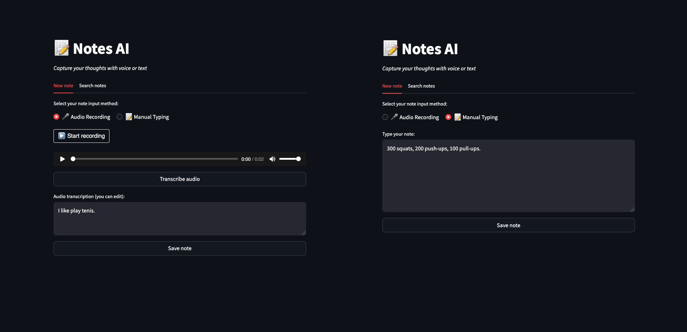
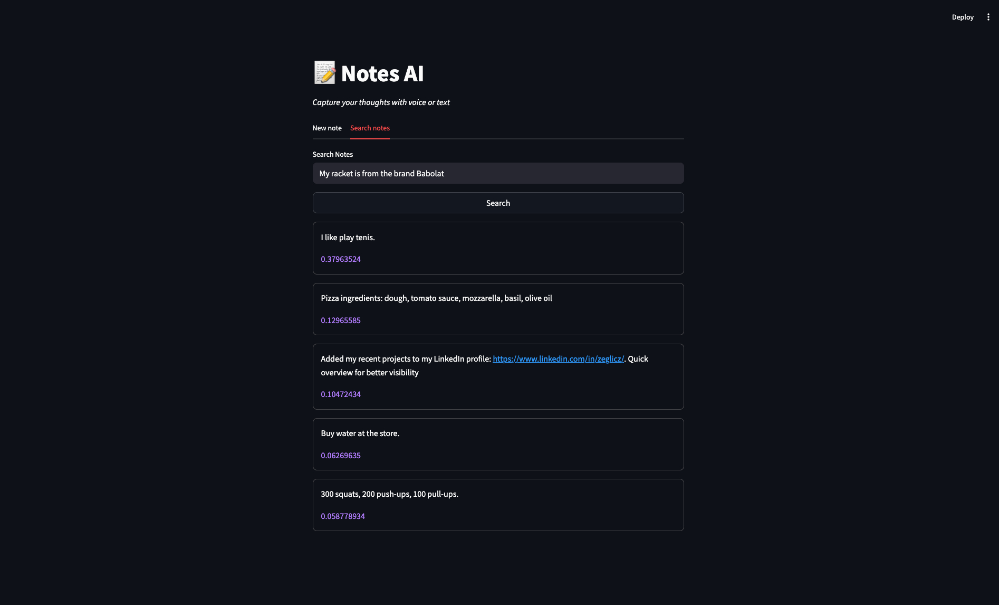

# <samp>📝 Notes-AI</samp>

## 📋 About the Project

Notes AI is an intelligent note management application that allows you to save thoughts in both text and voice formats. The application uses advanced AI technologies for audio transcription and note searching based on semantic similarity.

## 🚀 Demo

The application offers two intuitive tabs:

1. **New note** - Adding new notes in voice format with editing capability or text format



2. **Search notes** - Searching notes with similarity score results based on semantic similarity (using embeddings)



## ⚙️ Technologies

-   **Frontend/Backend**: Python, Streamlit
-   **OpenAI Integration**: whisper-1, text-embedding-3-large
-   **Vector Database**: Qdrant
-   **Audio Processing**: PyDub, FFmpeg
-   **Other Tools**: Python-dotenv, streamlit-audiorecorder

## 🔧 Installation and Setup

### System Requirements

-   FFmpeg (required for audio processing)

### Installing FFmpeg:

```bash
# Windows (chocolatey)
choco install ffmpeg

# macOS (homebrew)
brew install ffmpeg

# Ubuntu/Debian
sudo apt update && sudo apt install ffmpeg
```

### Application Installation:

```bash
# Clone repository
git clone https://github.com/zeglicz/notes-ai.git
cd notes-ai

# Install dependencies using conda (recommended - includes FFmpeg)
conda env create -f environment.yml
conda activate notes-ai

# Alternatively, use pip (requires prior FFmpeg installation)
pip install -r requirements.txt

# Configure environment variables
cp .env.example .env
# Edit the .env file and add your API keys

# Run the application
streamlit run app.py
```

## 🧠 Approach and Technical Solutions

The project implements a comprehensive approach to creating an intelligent note management application:

1. **Audio Processing** - using the Whisper model for transcribing voice recordings with the ability to edit results

2. **Embedding Generation** - automatic creation of vector representations of text using the text-embedding-3-large model, enabling semantic understanding of content

3. **Vector Database** - using Qdrant for efficient storage and searching of notes based on vector similarity

4. **State Management** - implementation of Streamlit session system for managing application state and user data

5. **User Interface** - intuitive interface with clear separation between note adding and searching modes

6. **Intelligent Search** - search system that finds semantically similar notes, even if they don't contain exactly the same words as the query

The application allows users to naturally record thoughts through speech or text, and then easily find information thanks to advanced natural language processing technologies.
